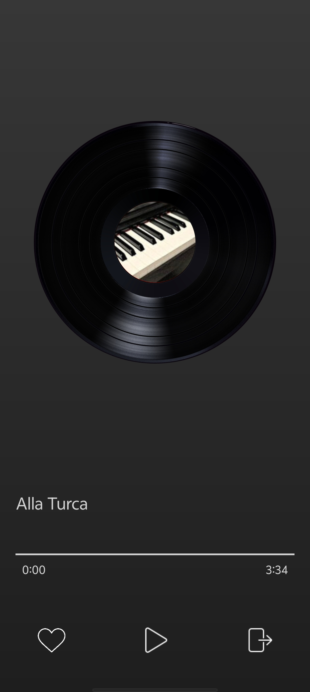

## About the Project

This project is a demo of using **Lynx**, a cross-platform development framework designed to provide a "write once, render anywhere" solution for building user interfaces across multiple platforms.

- 🌐 [Website](https://lynxjs.org/)
- 🧰 [GitHub](https://github.com/lynx-family/lynx)

## About the App

This app simulates the core interactions of a modern music player. You can swipe vertically to seamlessly switch between songs — similar to the "For You" feed experience — and interact with features like liking or sharing a song.



## What You’ll Learn

This demo showcases key features of the Lynx framework and React integration:

- How to scaffold a project using `rspeedy`
- Building UI with **React functional components** (without any extra framework)
- Using core Lynx UI elements: `<view>`, `<list>`, `<text>`, `<image>`
- Managing state with `jotai` atoms
- Implementing `<text>` inline truncation
- Applying CSS animations
- Using CSS variables effectively

## Getting Started

1. **Install dependencies**

```bash
pnpm install
```

2. **Start the development server**

```bash
pnpm run dev
```

3. **Preview on device**

Scan the QR code shown in your terminal using the LynxExplorer App.

- Get the app from the [Lynx Website](https://lynxjs.org/guide/start/quick-start.html).
- Or install from the [App Store](https://apps.apple.com/us/app/lynx-go-dev-explorer/id6743227790) or [Google Play](https://play.google.com/store/apps/details?id=com.funcs.io.lynx.go)

### 🧪 Step-by-Step Branches

Each development step is organized into a Git branch:

```bash
# Example: check out step #9
git checkout step-9
```

**Available Steps:**

- `step-1`: Create a project from scratch
- `step-2`: Build a vertical swipable song list
- `step-3`: Add `VinylRecord`, `ProgressBar`, and `ActionBar` components
- `step-4`: Add a `Song` model with relevant metadata
- `step-5`: Add a `MockPlayer` with basic playback methods
- `step-6`: Add `PlaybackManager` and implement `switchTo`, `togglePauseResume`, `toggleLike`
- `step-7`: Implement tap events in the Action Bar (Play & Like)
- `step-8`: Enable vertical swiping and update song titles
- `step-9`: Polish the UI layout
- `step-10`: Enlarge tap areas for better UX
- `step-11`: Make the progress bar interactive
- `step-12`: Use `jotai` for shared state (remove prop drilling)
- `step-13`: Use `useMemo` to prevent unnecessary re-renders
- `step-14`: Add spinning vinyl animation
- `step-15`: Organize assets and finalize visuals
- `step-16`: Use CSS variables for centralized color theming
